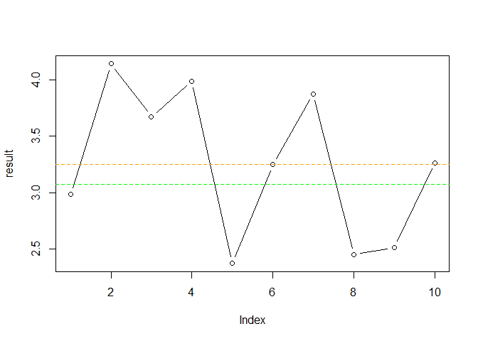
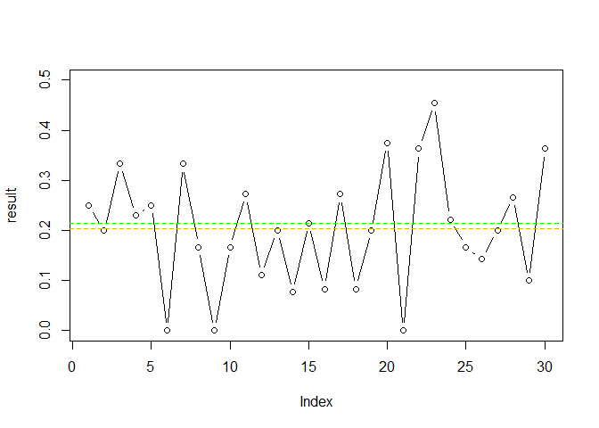

Population Sampling
================
Allen Li
26 September 2018

Test Page
---------

This is an R Markdown document. Markdown is a simple formatting syntax for authoring HTML, PDF, and MS Word documents. For more details on using R Markdown see <http://rmarkdown.rstudio.com>.

Sampling eCPM
-------------

``` r
# ecpm

sample_size = 15000
N = 10

pool_average_ecpm<-1000*sum(fl_data$rev)/sum(fl_data$row_number)
result <- c()
for (i in 1:N) 
result[i] = sum(sample_n(fl_data, sample_size)$rev)*1000/sample_size
plot(result, type = "b")
abline(h = pool_average_ecpm, col = "green", lty = 2)
abline(h = mean(result), col = "orange", lty = 2)
```



Sampling egagement per install
------------------------------

``` r
# Engagement per install

sample_size = 10000
N = 30

pool_average_epi<-sum(fl_data$Engagements)/sum(fl_data$Install)
result <- c()
for (i in 1:N) { 
  result[i] = (sample_n(fl_data, sample_size) %>% select(Engagements, Install) %>% summarise(epi = sum(Engagements)/sum(Install)))$epi
}
plot(result, type = "b", ylim = c(0, 0.5))
abline(h = pool_average_epi, col = "green", lty = 2)
abline(h = mean(result), col = "orange", lty = 2)
```


